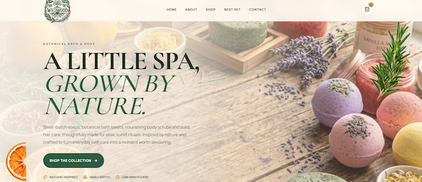
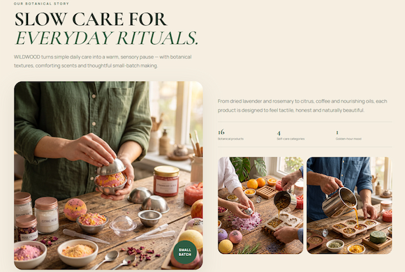
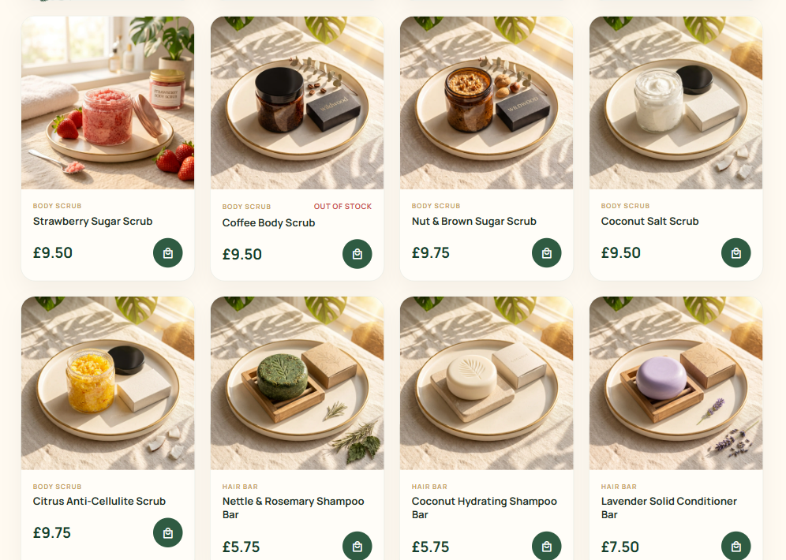
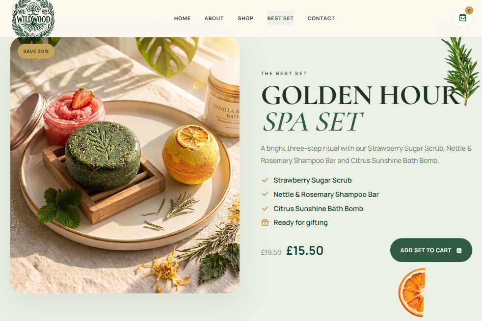
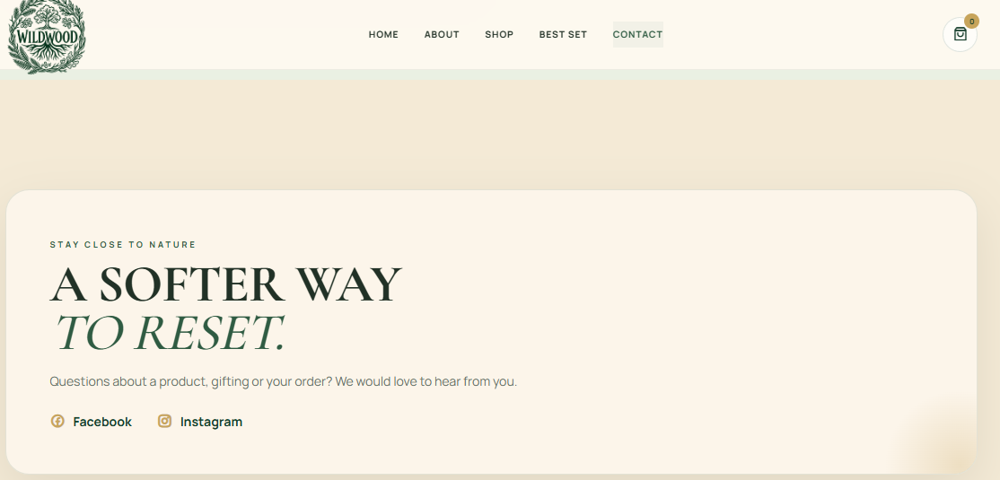

# 🌿 WILDWOOD Shop

A modern, fully responsive e-commerce website for a natural bath, body, and hair care brand, built with **HTML**, **CSS**, and **JavaScript**.

WILDWOOD combines a warm **Golden Hour Spa** aesthetic with natural botanical elements, soft sunlight, elegant typography, and a functional shopping experience.

## 🌐 Live Demo

👉 https://wildwood-shop.netlify.app/

### Home Page

A warm, nature-inspired hero section introducing the WILDWOOD brand and its collection of handmade bath, body, and hair care products.

### About

The About section introduces the philosophy behind WILDWOOD, focusing on natural ingredients, small-batch production, and simple everyday self-care rituals.

### Shop

A responsive product catalogue featuring soaps, bath bombs, body scrubs, solid shampoos, and conditioners with category filtering and interactive Add to Cart functionality.

### Golden Hour Spa Set

A curated three-step spa ritual combining the Strawberry Sugar Scrub, Nettle & Rosemary Shampoo Bar, and Citrus Sunshine Bath Bomb in one discounted gift set.

### Contact

A clean contact section with direct links to the brand's social media pages.

## ✨ Features

- 🌿 Golden Hour Spa inspired design
- 📱 Fully responsive mobile-first layout
- 🛍️ 16-product shop collection
- 🔎 Product filtering by category
- 🧼 Soaps, bath bombs, body scrubs, and solid hair care
- 🛒 Interactive shopping cart
- ➕ Add and remove products from cart
- 🔢 Product quantity management
- 💷 Automatic cart total calculation
- 🚫 Out-of-stock product states
- 🎁 Discounted Golden Hour Spa Set
- 💬 Optional order comment
- 🧾 Checkout modal and order form
- 📲 Telegram order notifications
- ✨ Animated botanical decorations
- 🖼️ Optimized WebP product images
- 🍔 Responsive mobile navigation
- 🔗 Social media integration
- 🎨 Custom WILDWOOD branding, logo, and favicon

## 🛠 Tech Stack

- HTML5
- CSS3
- JavaScript
- Netlify Functions
- Telegram Bot API
- Responsive Web Design
- CSS Grid
- Flexbox
- CSS Animations
- Remix Icon
- WebP image optimization

## 💡 What I Built

During this project I worked on:

- Creating a complete responsive e-commerce website from scratch
- Building a mobile-first interface for desktop, tablet, and mobile
- Developing a warm Golden Hour Spa visual concept
- Creating a 16-product catalogue across multiple product categories
- Implementing dynamic product filtering with JavaScript
- Building reusable product card components
- Implementing an interactive shopping cart
- Adding product quantity controls and automatic total calculation
- Creating out-of-stock states for unavailable products
- Building a checkout modal with form validation
- Creating a discounted Golden Hour Spa Set
- Integrating checkout orders with Telegram
- Using Netlify Functions to keep Telegram credentials outside the frontend
- Adding animated botanical decorative elements
- Optimizing product and lifestyle imagery for web performance
- Creating responsive mobile navigation
- Creating custom WILDWOOD branding with a logo and favicon

## 🛒 Shopping Cart

Customers can add available products and the Golden Hour Spa Set directly to their shopping cart.

The cart dynamically updates product quantities and automatically calculates the total order value.

Unavailable products are displayed with an **OUT OF STOCK** status to provide a more realistic e-commerce experience.

## 📲 Telegram Integration

Completed orders are sent directly to Telegram using the **Telegram Bot API**.

The integration uses a **Netlify serverless function**, keeping the bot token and chat ID securely stored as environment variables instead of exposing them in frontend JavaScript.

Order notifications include:

- Customer name
- Phone number
- Email address
- Ordered products
- Product quantities
- Total order value
- Optional customer comment

## 📁 Repository

👉 https://github.com/JenyaLinx/wildwood-shop

---

## 👨‍💻 Author

**Yevhenii Oliinyk**

GitHub: https://github.com/JenyaLinx

LinkedIn: https://www.linkedin.com/in/yevhenii-oliinykk
